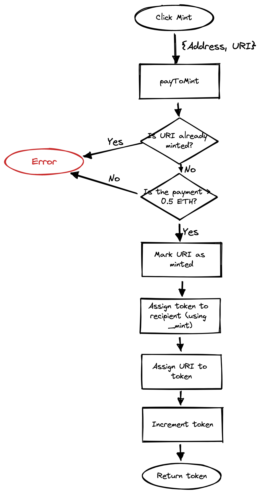

# Web3 - Full Tutorial

The demo contains a basic web3 app and smart contract for minting NFTs.

- See it in action in the [Web3 NFT Tutorial](https://youtu.be/meTpMP0J5E8) on YouTube.
- Follow the full [Web3 Tutorial](https://fireship.io/lessons/web3-solidity-hardhat-react-tutorial) on Fireship.

## Usage

```bash
npm install

# terminal 1
npx hardhat node

# terminal 2
npx hardhat compile
# This will create an artifacts/ directory in src/ which contains the compiled smart contract code

npx hardhat run scripts/sample-script.js --network localhost
# Update the deployed contract address in `components/Home.js` with this output

# terminal 3
npm run dev
```

At this point you'll have to download and install metamask to be able to interact with the smart contracts and send ethereum funds on the local testnet

## Understanding


